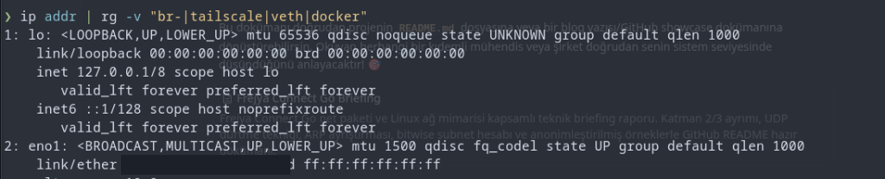
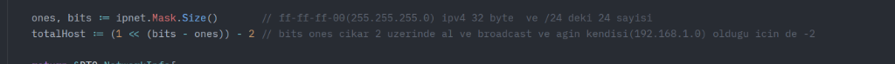
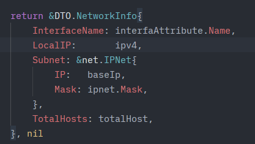
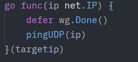
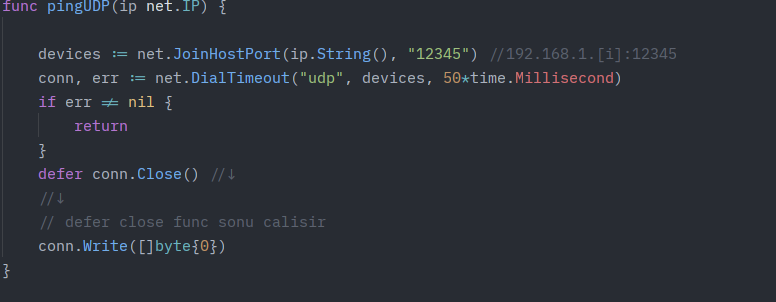

# ⚡ Frejya Connect — Go `net` & Linux Ağ Mimarisi Vaka Analizi (Case Study)

> **Geliştirici:** Arda Serbest  
> **Konu:** ISO/OSI Katmanları (L2, L3, L4), Go `net` Paketi Anatomisi ve Linux Çekirdek Düzeyinde Yerel Ağ Keşfi  
> **Odak:** Root İzni Olmadan (Zero-Root) Çekirdek ARP Manipülasyonu, Bitwise Alt Ağ Hesabı ve ADB/SSH Keşfi  

---

## 📌 Proje Durumu: Checkpoint 1 (Terminal Backend Aktif)

Bu repo, Go standart kütüphanesini (`net`) ve Linux ağ yığınını derinlemesine incelemek amacıyla geliştirilmiş yüksek performanslı bir ağ keşif ve bağlantı motorudur.

Şu anki aşamada:
- **Go Backend:** Tamamen aktif, bağımsız ve canlı test edilmiştir. 
- **Yerel Ağ Taraması:** Root/sudo yetkisine gerek duymadan 254 cihazlık bir alt ağı 1-2 saniye içinde çözümler.
- **Cihaz Tespiti:** Android ADB (5555), SSH (22), Web Paneli (80/443), Smart TV ve IEEE Rastgele MAC analizi yapar.
- **JSON API Çıktısı:** `--json` bayrağı ile frontend (Rust TUI) tüketimine hazırdır.
- **TUI (Terminal Kullanıcı Arayüzü):** İskeleti oluşturulmuş olup Rust (Ratatui 0.29 + Crossterm) ile geliştirilme aşamasındadır.

---

## 🚀 Hızlı Başlangıç

### Terminal Üzerinden Çalıştırma (Go Backend)
```bash
cd Backend
go run main.go
```

### JSON Formatında Çıktı Alma (Frontend / TUI Entegrasyonu İçin)
```bash
go run main.go --json
```

---

## 🔍 Giriş: Neden Katman 1 Yok, Neden L2 - L3 - L4?

Ağ programlamaya başlarken ISO/OSI modelinin 7 katmanı masaya yatırılmıştır. Bir yazılımcı olarak **Katman 1 (Fiziksel Katman)** doğrudan yazılımla kodlanamaz; çünkü Katman 1 bakır kablodaki voltaj dalgalanması, fiberdeki lazer fotonları veya havadaki Wi-Fi radyo dalgalarıdır.

Bu projede yazılımsal olarak kontrol ettiğimiz ve birbirine köprülediğimiz katmanlar şunlardır:
- **Katman 2 (Data Link / Veri Bağlantısı):** Ethernet kartı (NIC), MAC Adresi (`HardwareAddr`), MTU (1500 byte) ve ARP protokolü.
- **Katman 3 (Network / Ağ):** Mantıksal IP Adresleri (`net.IP`), Subnet Maskeleri (`net.IPMask`) ve CIDR yönlendirme.
- **Katman 4 (Transport / Taşıma):** Çekirdeği uyandırmak için kullandığımız UDP datagramları ve port taraması için TCP soketleri.

---

## 🛠️ Bölüm 1: Linux Çekirdeği Bayrakları ve Go `net.Interface` Anatomisi

Sistemdeki ağ kartlarını ve durumlarını incelerken ilk kanıtımız terminaldeki `ip addr` çıktısıdır:



### 1. `<...>` İçindeki Bayrakların (Flags) Sırrı: `UP` vs `LOWER_UP`
Çıktıdaki `eno1` kartına baktığımızda:
```text
2: eno1: <BROADCAST,MULTICAST,UP,LOWER_UP> mtu 1500 ...
```
Buradaki iki kritik bayrak sistem seviyesinde hayati bir fark taşır:
- **`LOWER_UP` (Katman 1 / Fiziksel Durum):** Ethernet kablosunun RJ45 soketine fiziksel olarak takılı olduğunu ve switch/modem ile elektriksel sinyalin (Carrier / Link beat) kurulduğunu gösterir. Kablo çekilirse bu bayrak düşer ve yerine `NO-CARRIER` gelir!
- **`UP` (Katman 2-3 / Yönetimsel Durum):** Kartın işletim sistemi tarafından yazılımsal olarak aktif edildiğini (`ip link set eno1 up`) gösterir. Kablo çekik olsa bile kart `UP` kalabilir!

### 2. Go'daki `net.Interface` Struct'ının Sınırları
Go kütüphanesinde `net.Interfaces()` çağrıldığında dönen struct tamamen **Katman 2** dünyasına aittir:

```go
type Interface struct {
    Index        int          // Sistemdeki arayüz sırası (ifindex)
    MTU          int          // Maksimum iletim birimi (Ethernet için 1500)
    Name         string       // "eno1"
    HardwareAddr HardwareAddr // Donanımsal MAC Adresi (Katman 2)
    Flags        Flags        // UP, Broadcast, Loopback bayrakları
}
```
> **Kritik Mimari Not:** `net.Interface` struct'ının içinde **IP adresi YOKTUR!**  
> Fiziksel Ethernet çipi IP bilmez. Kartın üzerindeki mantıksal IP'leri almak için karta `.Addrs()` sorusu sorulur ve Katman 3'e geçilir.

---

## 📐 Bölüm 2: Bit Düzeyinde Alt Ağ (Subnet) Matematiği

Kartın üzerindeki IPv4 adresi (`192.168.1.11/24`) bulunduktan sonra taranacak yerel ağın sınırlarını hesaplamak için ikilik tabanda (Bitwise) işlem yapılır:



### Formülün Matematiksel Kanıtı:
```go
ones, bits := ipnet.Mask.Size()
totalHost := (1 << (bits - ones)) - 2
```

1. **`ipnet.Mask.Size()`:**
   - Standart bir ev ağında maske `255.255.255.0` (`/24`)'tür.
   - `ones = 24` (Ağ için kilitlenmiş 1'lerin sayısı).
   - `bits = 32` (IPv4 adresinin toplam bit uzunluğu).
2. **Kalan Host Bitleri:**
   $$Host\ Bitleri = bits - ones = 32 - 24 = 8\ bit$$
3. **Bit Kaydırma (`1 << 8`):**
   $$1 \ll 8 = 2^8 = 256\ olası\ adres$$
4. **Neden `- 2` Çıkarılır?**
   - İlk adres (`192.168.1.0`): Ağın kendi temel kimliğidir (Network Base ID).
   - Son adres (`192.168.1.255`): Ağa toplu seslenme adresidir (Directed Broadcast).
   - Bu ikisi cihazlara atanamaz; geriye tam **254 adet** taranabilir canlı cihaz IP'si kalır!



Hesaplanan taban IP (`baseIp := ipv4.Mask(ipnet.Mask)` -> `192.168.1.0`) ve `totalHost: 254` bilgisi `DTO.NetworkInfo` çantasına konularak tarayıcı motora teslim edilir.

---

## ⚡ Bölüm 3: Zero-Root ARP Keşif Motoru (UDP "Dürtme" Hilesi)

Geleneksel tarayıcılar ağa doğrudan ARP paketi basabilmek için Linux'ta `CAP_NET_RAW` yetkisi ya da `root` gerektirir. Frejya Connect bu kısıtlamayı aşmak için Katman 4'ü (UDP) manivela gibi kullanarak Katman 2'yi (ARP) uyandırır:




### Algoritmanın Adım Adım İşleyişi:

```text
[Go Goroutine: 1..254]
       │
       ▼  net.DialTimeout("udp", "192.168.1.X:12345", 50ms)
[Linux Kernel Ağ Yığını]
       │
       ▼  Kernel Sorar: "Bu IP'ye paket atacağım ama MAC adresini bilmiyorum!"
[Otomatik Çekirdek ARP Yayını (Broadcast)]
       │
       ▼  Ağdaki Canlı Cihaz: "192.168.1.X benim, MAC adresim budur!"
[Linux /proc/net/arp Tablosu Dolar]
```

1. **`net.JoinHostPort(ip.String(), "12345")`:** Hedef IP'nin rastgele bir portuna (12345) yönlenilir.
2. **Neden UDP?** TCP gibi 3'lü el sıkışma (SYN-SYN/ACK-ACK) gerektirmez; tek taraflı fırlatılır. Karşı tarafın portu kapalı olsa bile fark etmez.
3. **`conn.Write([]byte{0})`:** 1 baytlık sembolik veri hatta basıldığı an, Linux çekirdeği paketi fiziksel kablodan çıkarabilmek için **mecburen hedef cihazın MAC adresini sormak (ARP Request)** zorunda kalır!
4. **`sync.WaitGroup` Gücü:** 254 cihazın tamamına 254 ayrı goroutine ile aynı anda paralel ateşlenir; tüm alt ağ 50 milisaniyede dürtülür.

---

## 📋 Bölüm 4: Linux `/proc/net/arp` Ayrıştırması ve Maskeleme

Paketler fırlatıldıktan sonra 150 ms beklenir ve Linux sanal dosya sistemindeki çekirdek önbelleği açılır:

```go
file, _ := os.Open("/proc/net/arp")
scanner := bufio.NewScanner(file)
scanner.Scan() // İlk satırdaki başlığı (IP address HW type...) çöpe at!
```

Her satır `strings.Fields(line)` ile ayrıştırılır:
- `fields[0]`: IP Adresi (`192.168.1.8`)
- `fields[2]`: Flags -> **`0x2` (`ATF_COM`)**: Bu bayrak cevabın geldiğini ve cihazın **yaşadığını/doğrulandığını** kanıtlar! `0x0` olan cevapsız hayaletler elenir.
- `fields[3]`: MAC Adresi
- `fields[5]`: Arayüz Adı (`eno1`)

---

## 🕵️ Bölüm 5: OUI Parmak İzi ve IEEE Gizli MAC Analizi

Elde edilen MAC adresi üzerinden iki kademeli analiz uygulanır:

1. **IEEE Standardı Rastgele MAC Kontrolü:**
   ```go
   if mac[0]&0x02 != 0 {
       return "📱 Gizli / Rastgele MAC (Android/iOS)"
   }
   ```
   İlk baytın 2. biti `1` ise (Locally Administered Address - LAA), bu cihazın gizlilik amacıyla rastgele MAC üreten bir mobil cihaz (iPhone/Android) olduğu matematiksel olarak kanıtlanır.
2. **OUI (Organizationally Unique Identifier):**
   İlk 3 bayt (`0C:CA:FB` -> Philips TV, `C0:49:43` -> ZTE Modem) harita tablosunda taranarak cihazın fiziksel markası çıkarılır.

---

## 📊 Canlı Terminal Çıktısı (Showcase)

*(Not: Cihaz MAC adreslerinin son 3 baytı güvenlik ve gizlilik gereği maskelenmiştir).*

```text
━━━━━━━━━━━━━━━━━━━━━━━━━━━━━━━━━━━━━━━━━━━━━━━━━━━━
✅ Aktif Kartımız : eno1
📍 Bizim IP       : 192.168.1.11
🌐 Alt Ağ (CIDR)  : 192.168.1.0/24
🎯 Taban IP (Base): 192.168.1.0
🔢 Cihaz Sınırı   : 254
━━━━━━━━━━━━━━━━━━━━━━━━━━━━━━━━━━━━━━━━━━━━━━━━━━━━
Bulunan Canlı Cihazlar: 8
----------------------------------------------------
  [1] IP: 192.168.1.1     | Tip: 🌐 Modem / Ağ Geçidi       | Üretici: ZTE Corporation (Fiber Modem)
       MAC: C0:49:43:XX:XX:XX
       └── Açık Port: 53    ➜ 📡 DNS Sunucusu
       └── Açık Port: 80    ➜ 🌐 HTTP (Modem Web Paneli)
       └── Açık Port: 443   ➜ 🔒 HTTPS (Güvenli Panel)

  [2] IP: 192.168.1.8     | Tip: 📱 Android / Smart TV (ADB)| Üretici: Philips Smart TV (TP Vision)
       MAC: 0C:CA:FB:XX:XX:XX
       └── Açık Port: 5555  ➜ 🎯 Android ADB (Scrcpy Yansıtma)
       └── Açık Port: 8008  ➜ 📺 Google Cast / Chromecast
       └── Açık Port: 8443  ➜ ⚙️ Alternatif HTTPS

  [3] IP: 192.168.1.2     | Tip: 🔌 Genel Ağ Cihazı          | Üretici: SJI Industry (Akıllı Priz)
       MAC: BC:10:2F:XX:XX:XX

  [4] IP: 192.168.1.3     | Tip: 📱 Mobil Cihaz (Gizli MAC) | Üretici: Gizli / Rastgele MAC (Android/iOS)
       MAC: 1E:91:90:XX:XX:XX

  [5] IP: 192.168.1.5     | Tip: 🔌 Genel Ağ Cihazı          | Üretici: Intel Corporation (PC Wi-Fi / NUC)
       MAC: 44:E5:17:XX:XX:XX
━━━━━━━━━━━━━━━━━━━━━━━━━━━━━━━━━━━━━━━━━━━━━━━━━━━━
```

---

## 🎯 Gelecek Adım: Rust TUI Entegrasyonu

Projenin bir sonraki aşamasında, `TUI/` klasöründeki **Ratatui (0.29)** ve **Crossterm** tabanlı terminal gösterge paneli tamamlanacak; cihazlar canlı tabloda seçilip `[C]` tuşuna basıldığında doğrudan `scrcpy` (ADB), SSH veya Web oturumları başlatılacaktır.
